# Веб-приложение для интеллектуального анализа текстовых документов.

Проект позволяет загружать документы, выполнять предварительную обработку текста,
проводить кластеризацию документов и визуализировать результаты анализа.

# Скриншоты

## Интерфейс приложения

### Основные страницы

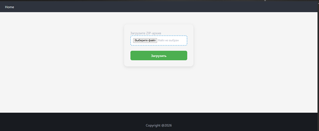

### Конечные каталоги

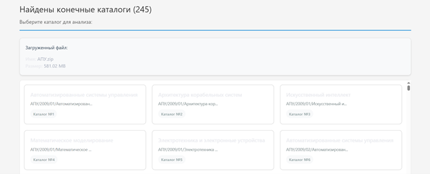

## Страница анализа каталога

### Анализ каталога

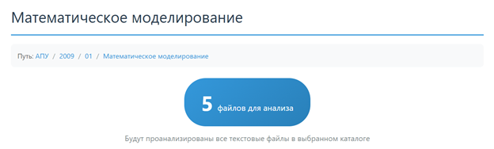

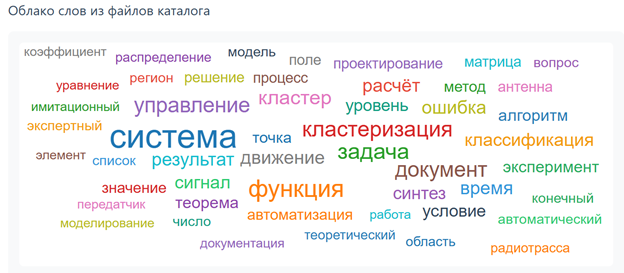

## Похожие каталоги

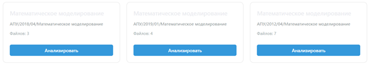

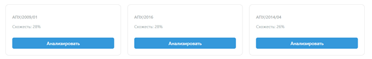

## Кластеризация

### K-Means

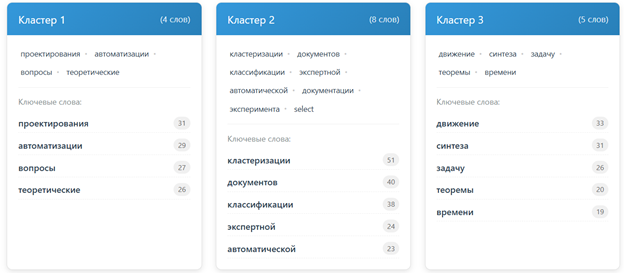

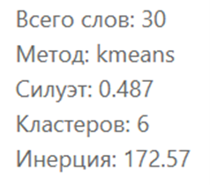

### DBSCAN

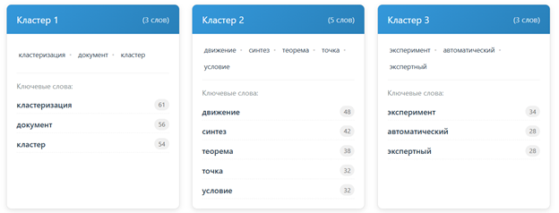

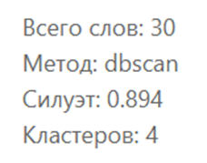

### Визуализация кластеров на плоскости

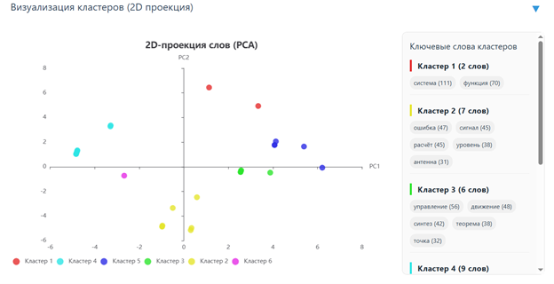

### Динамика интереса к теме (по кластерам)

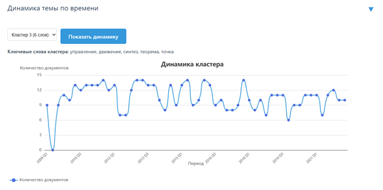

## Поиск по ключевым словам

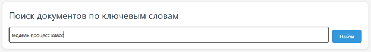

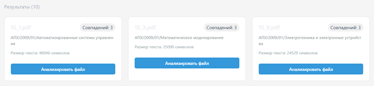
